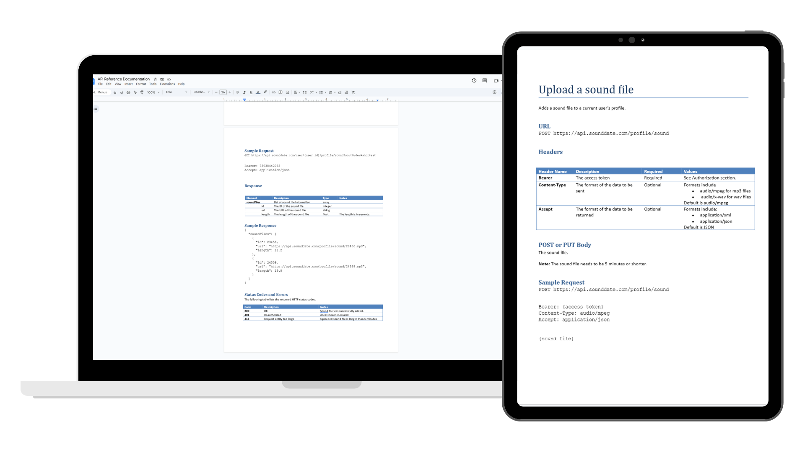

# API Reference Documentation

As part of a professional development course, I completed an API documentation project that simulated a real-world developer documentation workflow.

[Explore the guide](https://drive.google.com/file/d/110adIxhzHdqexMoL-U8D_UlCftUZ_KNY/view){ .md-button .md-button--primary }

## At a Glance

| | |
|---|---|
| **Role** | Technical Writer |
| **Organization** | Personal Professional Development (Udemy) |
| **Audience** | Software Developers |
| **Documentation Type** | API Reference Documentation |
| **Primary Skills** | API Documentation, Technical Research, Information Architecture, Developer Documentation |
| **Tools** | Google Docs, Markdown, REST APIs |

---

## My Role

I independently created a complete API reference based on the provided technical requirements.

My responsibilities included:

- Organizing endpoint documentation
- Writing concise endpoint descriptions
- Documenting headers, parameters, and request bodies
- Creating realistic sample requests and responses
- Explaining authentication requirements
- Clarifying validation rules and API constraints
- Structuring the documentation using common API documentation conventions

---

## Results

This project produced a complete API reference that:

- Documented multiple API endpoints using industry-standard conventions.
- Included realistic request and response examples.
- Explained authentication requirements and endpoint constraints.
- Organized technical information into a consistent, developer-friendly structure.
- Demonstrated my ability to adapt my writing style for a developer audience.
