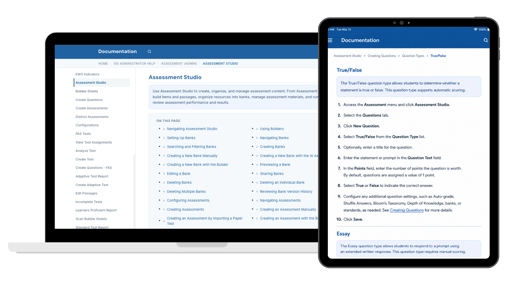

# Assessment Studio Documentation

Assessment Studio is Focus School Software's assessment platform, enabling school districts to create, deliver, manage, and analyze digital assessments. The platform supports administrators and teachers throughout the entire assessment lifecycle—from creating question banks and assessments to assigning tests, monitoring student progress, and analyzing results.

As the technical writer responsible for Assessment Studio documentation, I designed and maintained a comprehensive documentation system that supported both new and experienced users.

## At a Glance

| | |
|---|---|
| **Role** | Technical Writer |
| **Company** | Focus School Software |
| **Audience** | District Administrators, School Administrators, Teachers |
| **Documentation Type** | User Guides, Help Center, Release Notes |
| **Primary Skills** | Information Architecture, Content Strategy, Technical Writing, SME Collaboration |
| **Tools** | ScreenSteps, Jira, Google Docs, Assessment Studio, AI |

---

## My Role

I owned the end-to-end documentation experience for Assessment Studio.

My responsibilities included:

- Planning documentation for new product features
- Writing task-based help articles
- Designing logical information architecture for complex workflows
- Updating existing documentation with every software release
- Creating screenshots and visual examples
- Reviewing features with developers and QA engineers
- Translating technical requirements into user-focused guidance
- Identifying documentation gaps and opportunities for improvement
- Maintaining consistency across hundreds of pages of documentation

---

# Results

This project produced a comprehensive documentation ecosystem that supported users throughout every stage of the assessment process.

Highlights included:

- Documentation for dozens of new features
- Comprehensive workflow documentation
- Structured navigation for complex topics
- Consistent updates alongside product releases
- User-focused guidance that simplified complex educational workflows
- Documentation serving administrators, teachers, and district staff with varying levels of technical experience