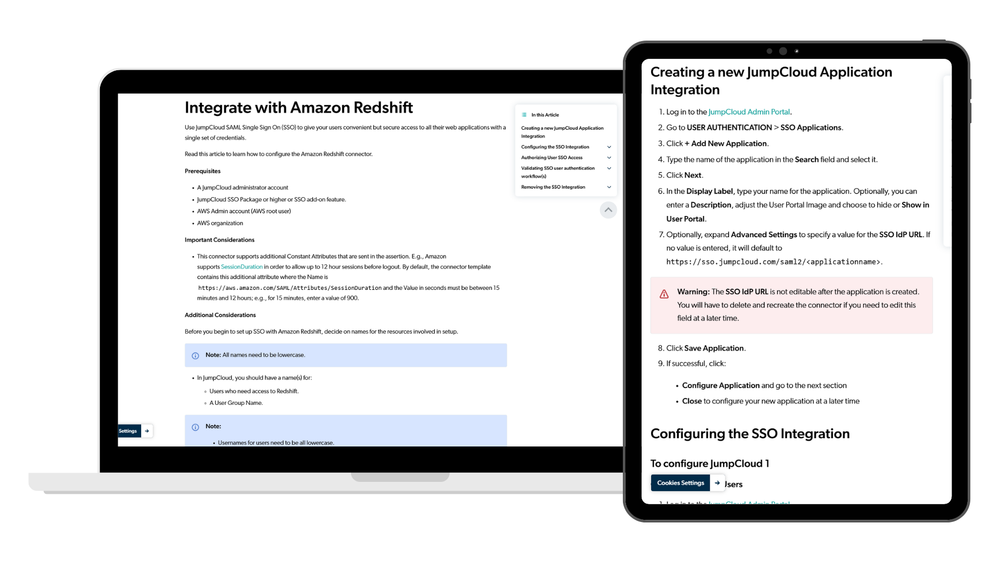

# Amazon Redshift Integration Guide

JumpCloud introduced a new SAML/SSO connector for Amazon Redshift, but the initial implementation guide left many administrators struggling with setup.

I completed the integration myself to understand the user experience firsthand, then rewrote the documentation to simplify complex concepts, clarify confusing steps, and create a more reliable implementation guide.

[Explore the guide](https://jumpcloud.com/support/integrate-with-amazon-redshift){ .md-button .md-button--primary }

## At a Glance

| | |
|---|---|
| **Role** | Technical Writer |
| **Company** | JumpCloud |
| **Audience** | IT Administrators |
| **Documentation Type** | Integration Guide |
| **Primary Skills** | Technical Research, Information Architecture, SME Collaboration, Technical Writing |
| **Tools** | Google Docs, Salesforce Knowledge, Jira, Snagit, AWS Redshift |

---

## My Role

I took ownership of understanding the integration before rewriting the documentation.

My responsibilities included:

- Completing the integration myself from start to finish
- Identifying unclear or missing instructions
- Documenting the setup process from a user's perspective
- Collaborating with engineers to validate technical details
- Rewriting procedures for greater clarity and accuracy
- Improving explanations around complex configuration steps

---

# Results

This project produced documentation that:

- Reflected the actual experience of completing the integration
- Reduced ambiguity in a complex configuration process
- Improved confidence for administrators implementing the connector
- Provided engineers with documentation they could trust to accurately represent the product