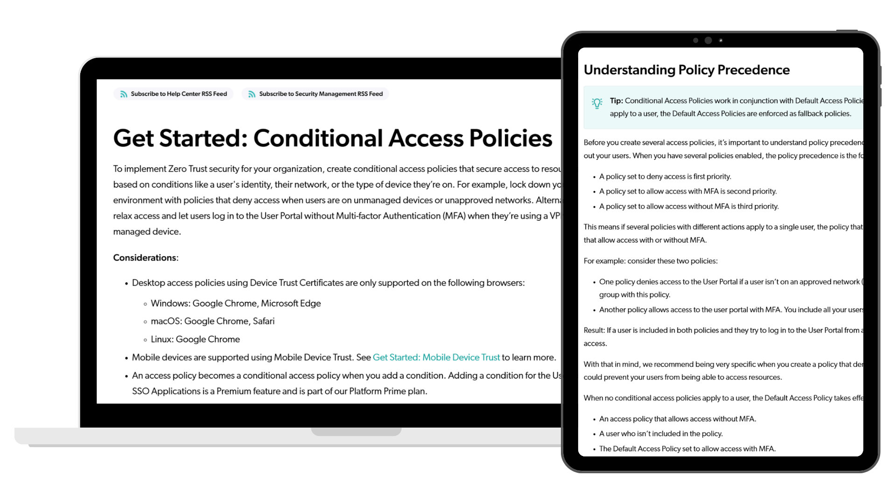

# Conditional Access Policies Documentation

Conditional Access Policies introduced a powerful new way for IT administrators to control access to applications based on conditions such as device type, user groups, or network location.

Because the feature introduced entirely new concepts and configuration paths, administrators needed documentation that explained the purpose behind each option and helped them confidently implement security policies.

I partnered closely with the product team throughout development to create documentation that evolved alongside the product and was ready for launch.

[Explore the guide](https://jumpcloud.com/support/get-started-conditional-access-policies ){ .md-button .md-button--primary }

## At a Glance

| | |
|---|---|
| **Role** | Technical Writer |
| **Company** | JumpCloud |
| **Audience** | IT Administrators |
| **Documentation Type** | Feature Guide |
| **Primary Skills** | Cross-Functional Collaboration, Feature Documentation, Agile Documentation, Information Architecture, Technical Writing, UX Writing, SME Interviews, Product Documentation, Technical Editing, Plain-Language Writing |
| **Tools** | Google Docs, Salesforce Knowledge, Jira, Figma, Snagit |

---

## My Role

I partnered with cross-functional stakeholders throughout the feature's development and took ownership of the documentation from early drafts through release.

My responsibilities included:

- Attending Agile ceremonies to stay informed about feature progress
- Reviewing designs with the UX team
- Meeting with engineers to understand technical implementation details
- Collaborating with the Product Manager to validate workflows and messaging
- Writing early-access documentation
- Creating launch-ready user documentation
- Reviewing and refining UI text for clarity and consistency
- Updating documentation as the feature evolved

---

# Results

This project delivered documentation that:

- Launched alongside a major new security feature
- Helped administrators understand both the purpose and configuration of Conditional Access Policies
- Supported product adoption through clear explanations and practical guidance
- Reflected ongoing collaboration with engineering, UX, and product teams throughout development