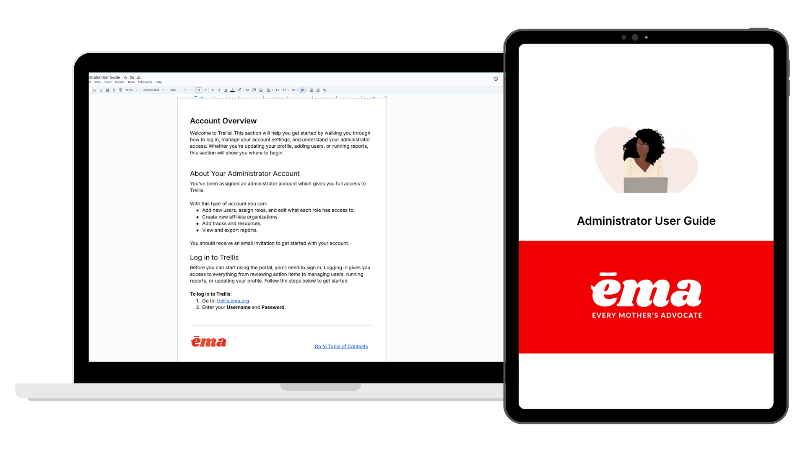

# ĒMA Trellis Documentation Suite

Servant partnered with Every Mother's Advocate (ĒMA) to develop the Trellis app, a platform designed to help staff and volunteers support mothers in crisis.

Because the application served multiple user roles with different responsibilities and permissions, each audience required documentation tailored to its specific workflows.

I was responsible for creating a complete documentation suite that included:

- Five comprehensive user guides
- Five quick start guides
- Approximately 150 tutorial videos

[Explore the guide](https://drive.google.com/file/d/1O8ectdbAswj2uaQUOO_QnHOFRvyvDBjQ/view ){ .md-button .md-button--primary }

## At a Glance

| | |
|---|---|
| **Role** | Technical Writer |
| **Company** | Servant |
| **Audience** | Administrators, Supervisors, Coordinators, Advocates, and Super Advocates |
| **Documentation Type** | User Guides, Quick Start Guides, and Video Tutorials |
| **Primary Skills** | Audience Analysis, Information Architecture, Technical Writing, Content Strategy |
| **Tools** | Google Docs, Snagit, Loom, ChatGPT |

---

## My Role

I created the documentation suite from the ground up.

My responsibilities included:

- Analyzing workflows for five different user roles
- Writing five comprehensive user guides
- Creating five companion quick start guides
- Producing approximately 150 task-based tutorial videos
- Organizing documentation so users could quickly find relevant information
- Maintaining consistent language, formatting, and structure across all deliverables

---

# Results

This project delivered:

- Five comprehensive user guides tailored to distinct audiences
- Five quick start guides for users who needed concise, task-focused documentation
- Approximately 150 tutorial videos demonstrating key workflows
- A consistent documentation experience across all user roles
- Resources that helped staff and volunteers learn the platform efficiently while supporting the organization's mission