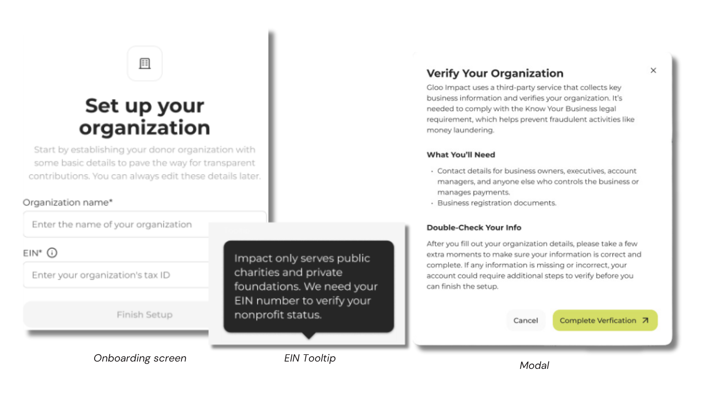

# Gloo Impact UX Writing

Gloo Impact is a platform that enables organizations to offer services—such as counseling, classes, and retreats—while allowing donors to sponsor participation.

Because users shared sensitive organizational and personal information during onboarding, every interaction needed to feel trustworthy, supportive, and easy to understand.

I created emails, tooltips, modal copy, and product tour content that guided users through key moments with clear, empathetic language that reduced uncertainty and encouraged confidence.

## At a Glance

| | |
|---|---|
| **Role** | UX Writer / Content Designer |
| **Company** | Servant |
| **Audience** | Nonprofit Organizations and Donors |
| **Documentation Type** | UX Writing & In-Product Content |
| **Primary Skills** | UX Writing, Content Design, User Journey Mapping, Plain-Language Writing |
| **Tools** | Figma, Google Docs, Slack, Snagit |

---

## My Role

I approached the project from a content design perspective, looking beyond individual interface elements to evaluate the overall onboarding journey.

My responsibilities included:

- Writing onboarding emails
- Creating tooltip copy
- Writing modal content
- Developing product tour messaging
- Simplifying complex onboarding requirements
- Ensuring a consistent voice across the onboarding experience
- Helping users understand the purpose behind sensitive requests

---

# Results

This project delivered:

- A more thoughtful onboarding experience for nonprofit organizations
- Clear explanations for sensitive verification requirements
- Consistent messaging across onboarding emails, tooltips, modals, and product tours
- UX writing that helped users understand both what they needed to do and why they were being asked to do it