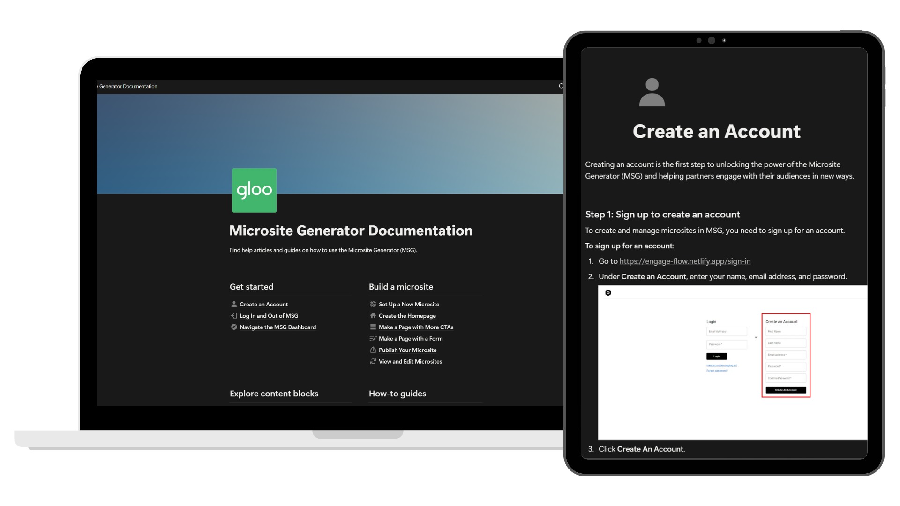

# Gloo Microsite Generator Help Center

Servant partnered with Gloo to develop the Microsite Generator, a tool that allowed another application to create and manage microsites through an API-driven workflow.

Although the tool functioned well, its interface and terminology reflected a developer's perspective, making it intimidating for the non-technical users who occasionally needed it.

I designed and built a Help Center in Notion. The goal was to create an organized, scalable knowledge base that made the Microsite Generator easier to understand, easier to navigate, and easier to maintain as the product evolved.

[Explore the help center](https://natbluhm.notion.site/Microsite-Generator-Documentation-8232ba3210b04358b48b731c8228ddf3?source=copy_link ){ .md-button .md-button--primary }

## At a Glance

| | |
|---|---|
| **Role** | Technical Writer |
| **Company** | Servant |
| **Audience** | Non-Technical Content Creators |
| **Documentation Type** | Help Center |
| **Primary Skills** | Information Architecture, Content Strategy, Technical Writing, UX Documentation |
| **Tools** | Notion, Google Docs, Snagit, Microsoft Clipchamp |

---

## My Role

I owned both the documentation and the overall Help Center design.

My responsibilities included:

- Meeting with the Technical Lead Engineer to understand the product
- Designing the Help Center's navigation and structure
- Creating reusable documentation templates
- Writing task-based documentation for the Microsite Generator
- Simplifying technical language for non-technical audiences
- Creating screenshots and tutorial videos to reinforce written instructions

---

# Results

This project delivered:

- A brand-new Help Center built from the ground up
- A scalable documentation framework for future content
- Clear task-based guidance that reduced reliance on engineering support
- Documentation that made a technical tool more approachable for non-technical users through thoughtful organization and visual learning resources