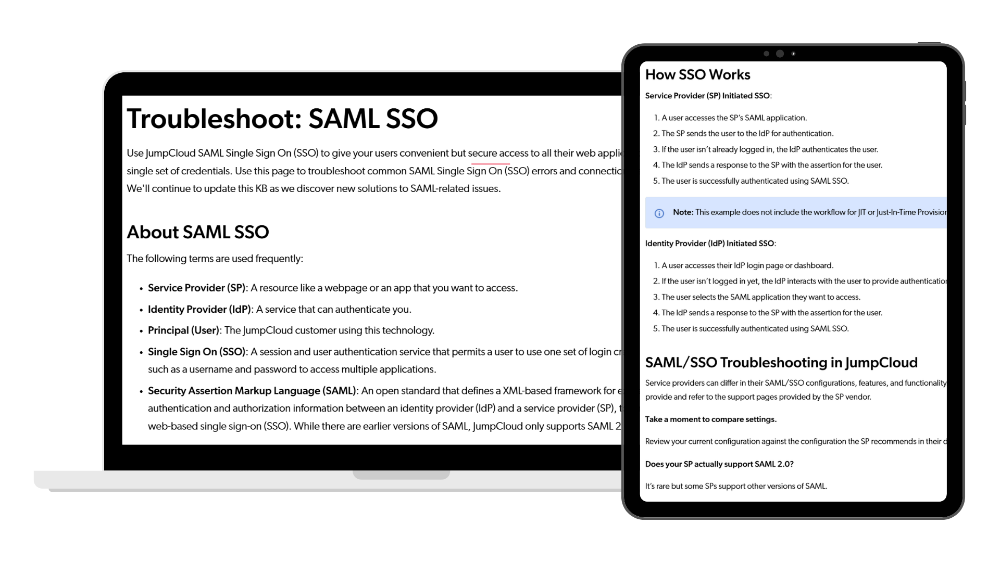

# JumpCloud SAML Troubleshooting Guide

SAML Single Sign-On (SSO) is one of JumpCloud's most widely used authentication features, but it is also one of the most challenging to configure. Even a small configuration error can prevent users from accessing their applications, resulting in frustration and an increase in support requests.

I was tasked with improving the troubleshooting documentation so administrators could identify and resolve common SAML configuration issues more quickly and with greater confidence.

[Explore the guide](https://jumpcloud.com/support/saml-sso-troubleshooting ){ .md-button .md-button--primary }

## At a Glance

| | |
|---|---|
| **Role** | Technical Writer |
| **Company** | JumpCloud |
| **Audience** | IT Administrators |
| **Documentation Type** | Troubleshooting Guide |
| **Primary Skills** | Customer Research, Troubleshooting, Information Architecture, Technical Writing, Cross-functional Collaboration |
| **Tools** | Google Docs, ScreenSteps, Jira, Confluence, Snagit, JumpCloud Admin Portal |

---

## My Role

I owned the documentation effort from research through publication.

My responsibilities included:

- Meeting with Customer Support to understand the most common SAML support issues
- Identifying recurring customer pain points and areas of confusion
- Rewriting troubleshooting content using clear, approachable language
- Organizing information into a more logical troubleshooting workflow
- Writing step-by-step instructions for both technical and non-technical audiences
- Reviewing documentation for clarity, accuracy, and usability

---

# Results

This project produced documentation that:

- Addressed the most common customer pain points
- Helped users troubleshoot SAML configuration issues more independently
- Gave Customer Support a reliable resource they could confidently share with customers
- Made complex authentication concepts easier to understand through clear explanations and task-based guidance